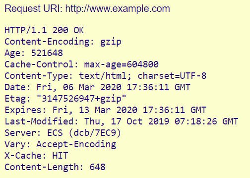

<p align="center"></p>

# Website Information
Basically, it's the act of searching for and finding web content. Therefore, based on this principle, we have three content discovery methods: Manually, Automated and OSINT (Open-Source Intelligence).

**Remember that this repository is only intended for cybersecurity studies!**
## Manually 
Manually are manual searches that we can check from a website. Here we'll look at some ways of searching.

### **Robots.txt**
This is a file designed to tell you which urls on a site can be accessed.With this file we can gain access to various locations that they don't want us to access or discover.

##### **Example** -> https://target.com/robots.txt
```javascript
User-agent: *
Disallow: /admin
Allow: /admin-lore.php
```

<code>You can learn more here: https://developers.google.com/search/docs/crawling-indexing/robots/intro?hl=pt-br</code>

### Sitemap.xml
Sitemap is a file used by search engines that contains the structure of the site. In other words, it contains the relationships and information of the pages on a site. Often, robots.txt gives us access to where the sitemap directory is located, and one of the main differences is that robots.txt contains directories and files that should not be indexed. In this way, with small manual analyses like these, we can get a lot of information about the structure of a website.

<code>You can learn more here:
https://www.sitemaps.org/protocol.html#otherformats</code>

#### Examples:
```javascript
<sitemapindex>
<sitemap>
<loc>https://www.target.com/search/about/sitemap.xml</loc>
</sitemap>
<sitemap>
<loc>https://www.target.com/sitemap_explore.xml</loc>
</sitemap>
<sitemap>
<loc>https://www.target.com/about/sitemap.xml</loc>
</sitemap>
<sitemap>
<loc>https://www.target.com/photos/sitemap.xml</loc>
</sitemap>
</sitemapindex>
```

OR:
```javascript
XML Sitemap

Generated by Yoast SEO, this is an XML Sitemap, meant for consumption by search engines.
You can find more information about XML sitemaps on sitemaps.org.

This XML Sitemap Index file contains 3 sitemaps.
Sitemap	Last Modified
https://target.com/post-sitemap.xml	2900-02-02 10:19 +00:00
https://target.com/page-sitemap.xml	2803-01-10 00:06 +00:00
https://target.com/category-sitemap.xml	2072-02-07 01:19 +00:00
```

### HTTP Headers
HTTP headers are precisely the request and response between the node and the server. From it, we can gather information about the website and analyze possible vulnerabilities.

<code>You can learn more here:
https://developer.mozilla.org/en-US/docs/Web/HTTP/Headers</code>
#### Example:
<p align="center"></p>